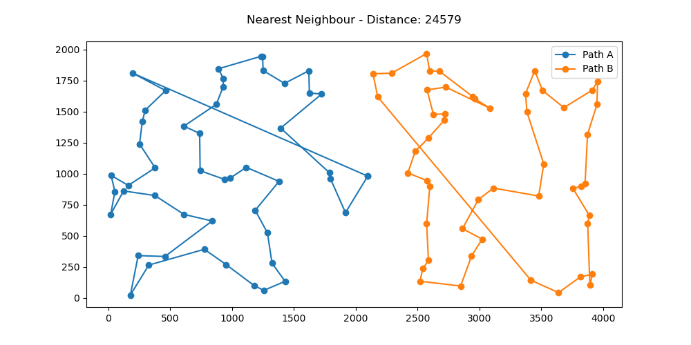
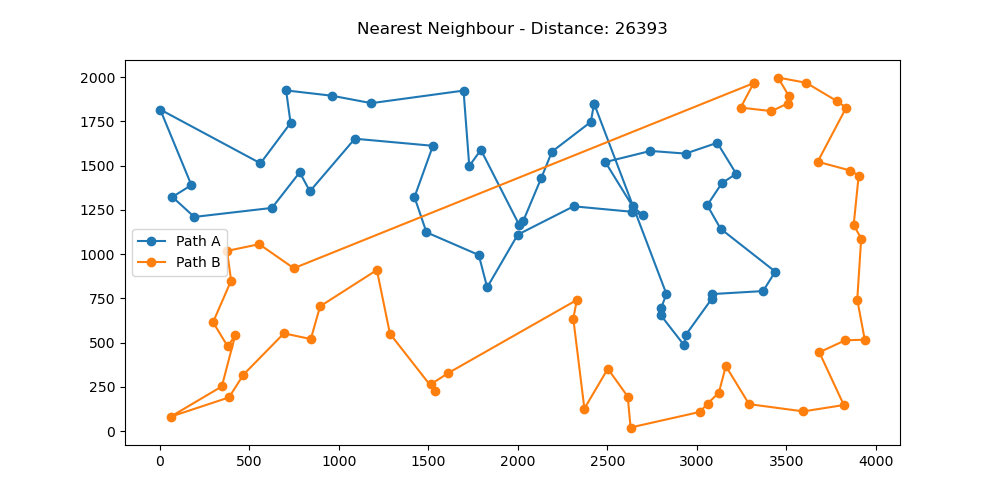
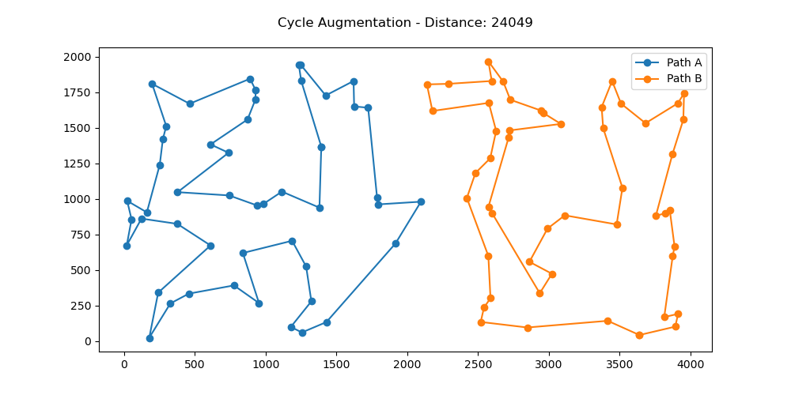
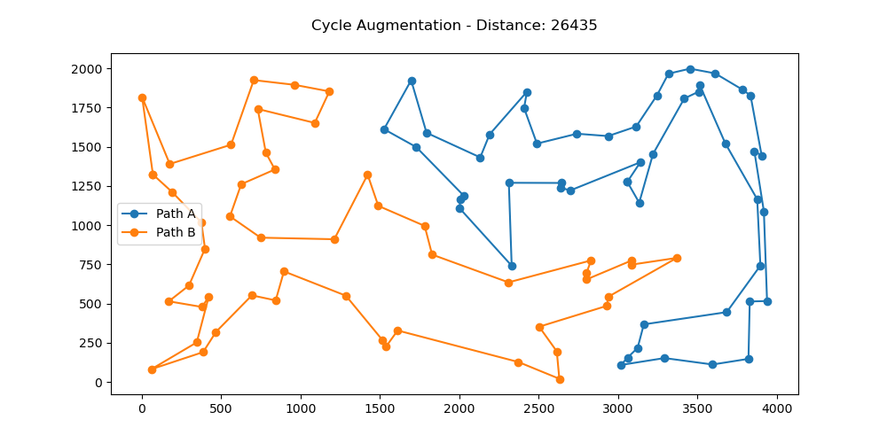
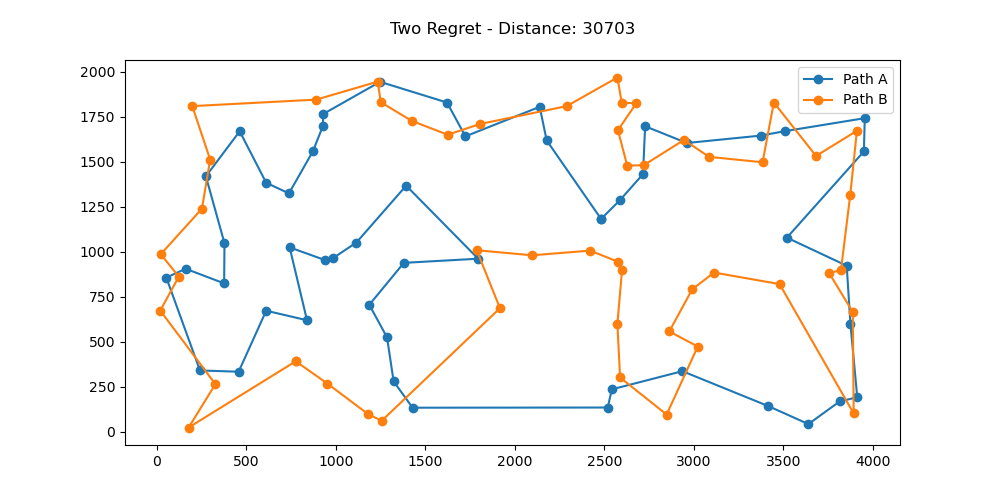
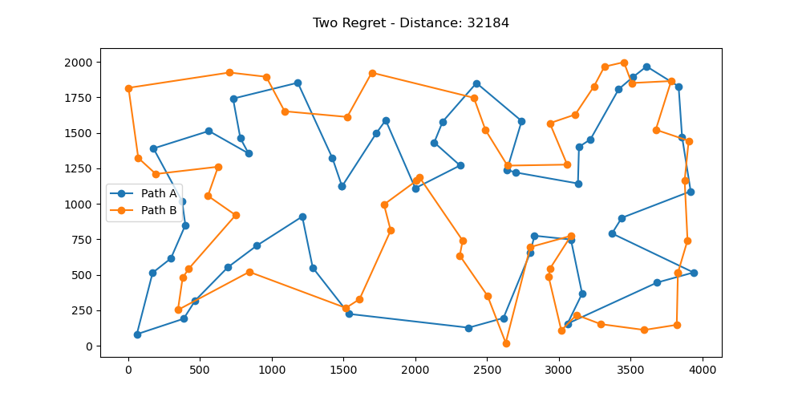

# Laboratorium 1 - Algorytmy heurystyczne

## Autorzy: Michał Pawlicki, Mateusz Noworolnik

## Opis zadania

Problem komiwojażera w podstawowej wersji polega na znalezieniu najkrótszego cyklu Hamiltona w pełnym grafie ważonym.
W zmodyfikowanej wersji tworzone są dwa rozłączne cykle, które łącznie pokrywają wszystkie wierzchołki podane w instancji.
W zadaniu zaimplementowano trzy algorytmy: Nearest Neighbour, Cycle Augmentation, Two Regret oraz uruchomiono je na dwóch instancjach problemu kroA100 i kroB100.

## Opis algorytmów

## Wynik eksperymentów

| Algorytm           | kroA                  | kroB                  |
| ------------------ | --------------------- | --------------------- |
| Nearest Neighbour  | 29088.2(24579-32121)  | 28420.27(26393-31106) |
| Cycle Augmentation | 28454.71(24049-30325) | 28171.18(26435-30700) |
| Two Regret         | 32338.45(30703-33659) | 33524.22(32184-35386) |

## Wizualizacja wyników

## Wnioski

- Algorytm Nearest Neighbour jest najmniej skomplikowany, ale w swoich obliczeniach nie uwzględnia powstałej odległości między ostatnim a pierwszym wierzchołkiem, co powoduje,
  że jest ona zazwyczaj niepotrzebnie długa.

- Algorytm Cycle Augmentation jest bardziej skomplikowany, ale zwraca lepsze wyniki niż Nearest Neighbour. W jego przypadku wyżej wymieniony problem nie występuje.

- Algorytm Two Regret jest najbardziej skomplikowany, ale zwraca najgorsze wyniki. Jest to spowodowane tym, że

## Kod programu

https://github.com/michal-pawlicki/inteligentne-metody-optymalizacji/tree/main/Lab1
