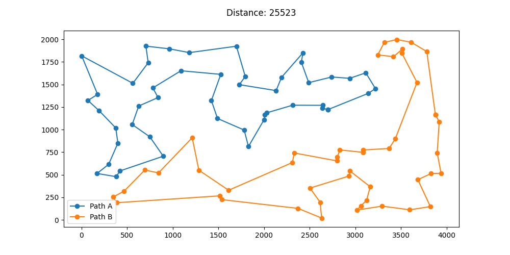

# Laboratorium 2 - Lokalne przeszukiwane

## Autorzy: Michał Pawlicki, Mateusz Noworolnik

## Opis zadania

Zadanie lokalnego przeszukiwania polega na znalezieniu optymalnej ścieżki dla problemu komiwojażera. W tym celu zaimplementowano trzy algorytmy przeszukiwania lokalnego: przeszukiwanie strome, przeszukiwanie zachłanne oraz przeszukiwanie losowe. Wszystkie algorytmy jako rozwiązanie początkowe przyjmują rozwiązanie zwrócone przez algorytm rozbudowy cyklu lub algorytm tworzący losowe rozwiązanie. Dla każdego algorytmu przeprowadzono eksperymenty dla dwóch różnych typów sąsiedztwa, gdzie pierwsze z nich obejmowało ruchy polegające na zamianie dwóch krawędzi między trasami oraz zamianie dwóch krawędzi wewnątrz trasy, a drugie obejmowało ruchy polegające na zamianie dwóch krawędzi między trasami oraz zamianie dwóch wierzchołków wewnątrz trasy.

## Opis algorytmów i funkcji pomocniczych

### Znajdź najleprzy ruch międzytrasowy

```
Wygeneruj wszystkie pary indeksów, w których jeden pochodzi z jednej trasy a drugi z drugiej.
Dla każdej pary indeksów:
  Oblicz deltę, która powstanie po dodaniu i odjęciu odpowiednich krawędzi
  Jeżeli delta jest mniejsza od najlepszej znalezionej dotychczas to zapisz dany ruch jako najlepszy
Zwróć najlepszy ruch
```

### Znajdź najlepszy ruch wewnątrztrasowy

```
Wygeneruj wszystkie pary indeksów, w których oba indeksy pochodzą z tej samej trasy.
Dla każdej pary indeksów:
  Oblicz deltę, która powstanie po dodaniu i odjęciu odpowiednich krawędzi, w zależności od typu sąsiedztwa
  Jeżeli delta jest mniejsza od najlepszej znalezionej dotychczas to zapisz dany ruch jako najlepszy
Zwróć najlepszy ruch
```

### Przeszykiwanie w wersji stromej

```
Wczytaj rozwiązanie początkowe
Powtarzaj dopóki delta najlepszego ruchu mniejsza od 0:
  Znajdź najlepszy ruch międzytrasowy
  Znajdź najlepszy ruch wewnątrztrasowy
  Jeżeli najlepszy ruch międzytrasowy jest lepszy niż wewnątrztrasowy to wykonaj go
  W przeciwnym wypadku wykonaj ruch wewnątrztrasowy
  Zaktualizuj długość trasy
  Jeżeli oba ruchy są gorsze od obecnego rozwiązania to zakończ
```

### Znajdź pierwszy ruch międzytrasowy

```
Wygeneruj wszystkie pary indeksów, w których jeden pochodzi z jednej trasy a drugi z drugiej.
Dla każdej pary indeksów:
  Oblicz deltę, która powstanie po dodaniu i odjęciu odpowiednich krawędzi
  Jeżeli delta jest mniejsza od 0 to zwróć dany ruch
```

### Znajdź pierwszy ruch wewnątrztrasowy

```
Wygeneruj wszystkie pary indeksów, w których oba indeksy pochodzą z tej samej trasy.
Dla każdej pary indeksów:
  Oblicz deltę, która powstanie po dodaniu i odjęciu odpowiednich krawędzi, w zależności od typu sąsiedztwa
  Jeżeli delta jest mniejsza od 0 to zwróć dany ruch
```

### Przeszukiwanie w wersji zachłannej

```
Wczytaj rozwiązanie początkowe
Powtarzaj dopóki delta najlepszego ruchu mniejsza od 0:
  Wylosuj czy ruch ma być międzytrasowy czy wewnątrztrasowy
  Jeżeli ruch ma być międzytrasowy to:
    Znajdź pierwszy ruch międzytrasowy
    Jeżeli delta ruchu jest większa od 0:
      Znajdź pierwszy ruch wewnątrztrasowy
  W przeciwnym wypadku:
    Znajdź pierwszy ruch wewnątrztrasowy
    Jeżeli delta ruchu jest większa od 0:
      Znajdź pierwszy ruch międzytrasowy
  Jeżeli delta zwróconege ruchu jest mniejsza od 0:
    Wykonaj ten ruch
    Zaktualizuj długość trasy
  W przeciwnym wypadku zakończ
```

### Przeszukiwanie w sposób losowy

```
Wczytaj rozwiązanie początkowe
Powtarzaj dopóki nie skończy się limit czasu:
  Wylosuj czy ruch ma być międzytrasowy czy wewnątrztrasowy
  Jeżeli ruch ma być międzytrasowy to:
    Wykonaj losowy ruch międzytrasowy
  W przeciwnym wypadku:
    Wykonaj losowy ruch wewnątrztrasowy
  Zaktualizuj długość trasy
  Jeżeli aktualna długość trasy jest mniejsza od najlepszej to zapisz rozwiązanie jako najlepsze
```

## Wynik eksperymentów

### KroA

| Konfiguracja                | Wartość funkcji celu               | Czas                              |
|-----------------------------|------------------------------------|-----------------------------------|
| cycle edges greedy          | 28175.9 (24906 - 30229)            | 14.08 (3.0 - 42.0)                |
| cycle edges steepest        | 27987.03 (25464 - 30119)           | 15.69 (7.0 - 32.0)                |
| cycle edges random_walk     | 30544.05 (26698 - 32670)           | 250.0 (250.0 - 250.0)             |
| cycle vertices greedy       | 28449.45 (26149 - 30416)           | 9.01 (3.0 - 29.0)                 |
| cycle vertices steepest     | 28393.1 (26177 - 30392)            | 12.61 (5.0 - 48.0)                |
| cycle vertices random_walk  | 30544.05 (26698 - 32670)           | 250.0 (250.0 - 250.0)             |
| random edges greedy         | 30696.66 (25075 - 34733)           | 103.32 (65.0 - 214.0)             |
| random edges steepest       | 30468.77 (26841 - 35858)           | 90.64 (79.0 - 145.0)              |
| random edges random_walk    | 149599.17 (141729 - 158735)        | 250.0 (250.0 - 250.0)             |
| random vertices greedy      | 43063.84 (33448 - 50455)           | 105.61 (74.0 - 170.0)             |
| random vertices steepest    | 45339.16 (36711 - 51566)           | 107.34 (81.0 - 152.0)             |
| random vertices random_walk | 149056.81 (140156 - 157975)        | 250.0 (250.0 - 250.0)             |


### cycle edges greedy


### cycle edges steepest


### cycle edges random_walk


### cycle vertices greedy


### cycle vertices steepest


### cycle vertices random_walk


### random edges greedy


### random edges steepest


### random edges random_walk


### random vertices greedy


### random vertices steepest


### random vertices random_walk


### KroB

| Konfiguracja                | Wartość funkcji celu             | Czas                              |
|-----------------------------|----------------------------------|-----------------------------------|
| cycle edges greedy          | 27419.01 (25307 - 30148)         | 17.24 (3.0 - 192.0)               |
| cycle edges steepest        | 27433.43 (25523 - 29845)         | 16.13 (8.0 - 81.0)                |
| cycle edges random_walk     | 31089.52 (27841 - 33170)         | 250.0 (250.0 - 250.0)             |
| cycle vertices greedy       | 28627.16 (25885 - 41390)         | 9.58 (2.0 - 92.0)                 |
| cycle vertices steepest     | 28815.29 (26415 - 44366)         | 12.51 (4.0 - 106.0)               |
| cycle vertices random_walk  | 31051.13 (27841 - 33145)         | 250.0 (250.0 - 250.0)             |
| random edges greedy         | 31144.7 (25888 - 36108)          | 111.89 (65.0 - 234.0)             |
| random edges steepest       | 31379.24 (28415 - 34381)         | 91.76 (77.0 - 164.0)              |
| random edges random_walk    | 147537.71 (136176 - 156149)      | 250.0 (250.0 - 250.0)             |
| random vertices greedy      | 42863.86 (34466 - 54765)         | 104.57 (61.0 - 177.0)             |
| random vertices steepest    | 46075.47 (36350 - 56109)         | 107.38 (84.0 - 154.0)             |
| random vertices random_walk | 147399.68 (137110 - 154785)      | 250.0 (250.0 - 250.0)             |

### cycle edges greedy


### cycle edges steepest


### cycle edges random_walk


### cycle vertices greedy


### cycle vertices steepest


### cycle vertices random_walk


### random edges greedy


### random edges steepest


### random edges random_walk


### random vertices greedy


### random vertices steepest


### random vertices random_walk


## Wnioski
Największy wpływ na jakość rozwiązania ma zastosowane sąsiedztwo, lepiej pod tym względem wypadają zamiany krawędzi wewnątrz tras. Wersja algorytmu ma mniejsze znaczenie - zarówno dla wersji stromej, jak i zachłannej otrzymano podobne wyniki. Są one jednak lepsze od losowego błądzenia, co szczególnie widać przy rozpoczynaniu od rozwiązań losowych. Wybór algorytmu konstrukcyjnego również ma znaczenie - zaczynając lokalne przeszukiwanie od rozwiązania skonstruowanego na podstawie algorytmu rozbudowy grafu otrzymano lepsze rezultaty niż przy rozpoczynaniu z rozwiązań losowych.


## Kod programu

https://github.com/michal-pawlicki/inteligentne-metody-optymalizacji/tree/main/Lab2
