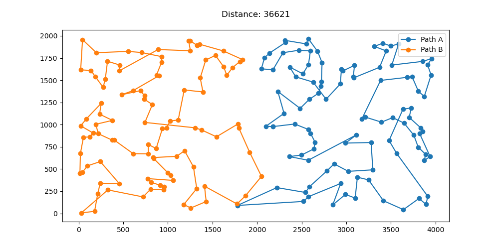
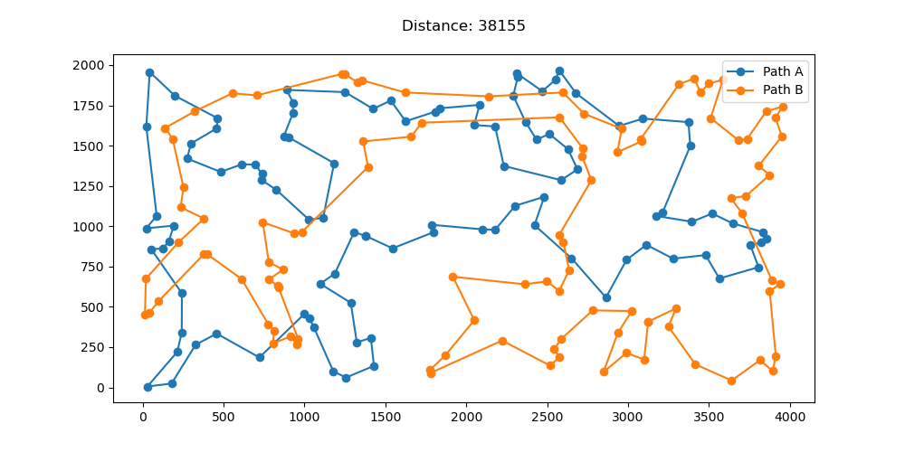
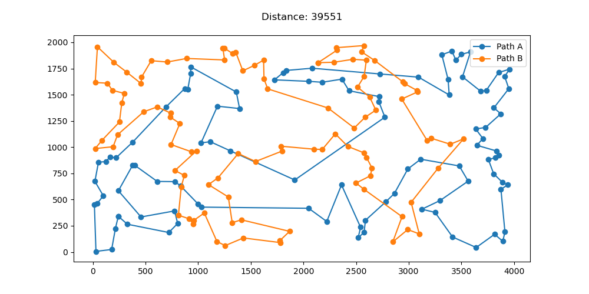
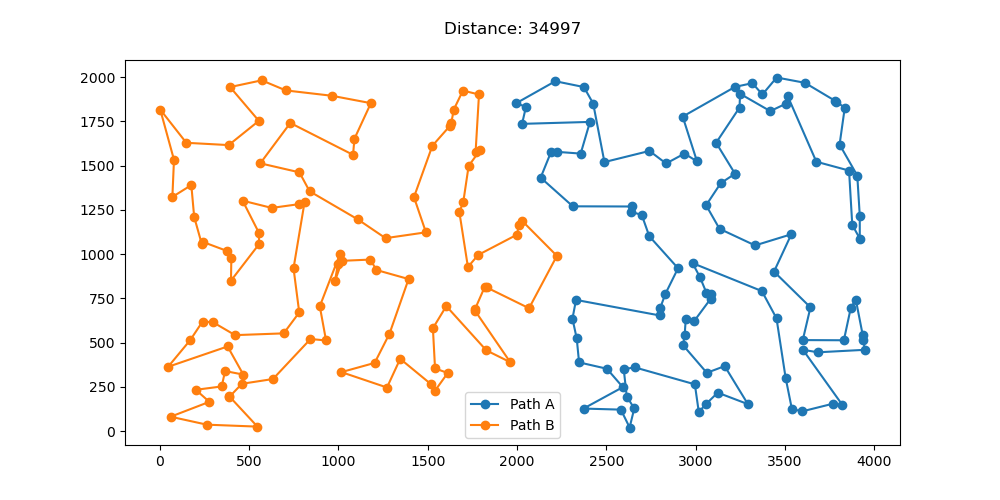
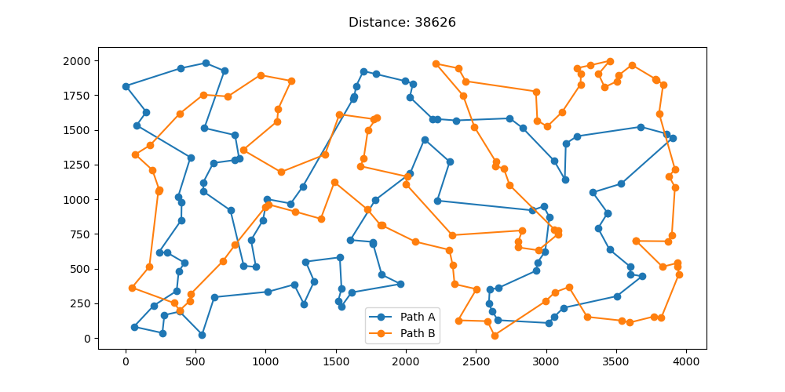
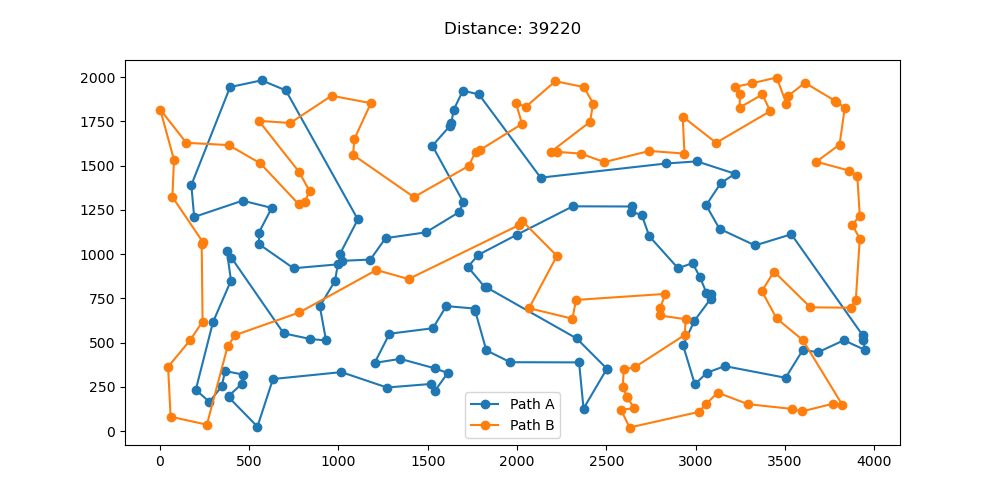

# Laboratorium 3 - Optymalizacja efektywności lokalnego przeszukiwania

## Autorzy: Michał Pawlicki, Mateusz Noworolnik

## Opis zadania

Celem zadania jest usprawnienie efektywności algorytmów lokalnego przeszukiwania dla problemu komiwojażera. Zaimplementowano dwa algorytmy: wykorzystanie ruchów z poprzednich iteracji oraz przeszukiwanie z wyorzystaniem ruchów kandydackich. Algorytmy zostały uruchomione na instancjach problemu kroA200 i kroB200. W celu porównania efektywności algorytmów przetestowano również algorytm przeszukiwania lokalnego w wersji stromej oraz algorytm rozbudowy cyklu.

## Opis algorytmów i funkcji pomocniczych

### Przeszukiwanie z wykorzystaniem ocen ruchów z poprzednich iteracji

```
Wczytaj rozwiązanie początkowe
Zainicjuj listę ruchów
Dodaj do listy ruchów wszystkie możliwe ruchy z sąsiedztwa, których obliczona delta jest mniejsza od 0
Powtarzaj:
  Dla każdego ruchu na liście:
    Jeśli jest to zamiana krawędzi:
      Jeśli krawędzie nie występują w żadnej ścieżce:
        Usuń ruch z listy
      Jeśli krawędzie występują w ścieżce i mają ten sam kierunek:
        Zapisz ruch jako najlepszy
        Usuń ruch z listy
        Przerwij
    Jeśli jest to zmiana wierzchołków:
      Jeśli wierzchołki są w tej samej ścieżce:
        Usuń ruch z listy
      Jeśli w ścieżce istnieją dla obu wierzchołków krawędzie postaci poprzednik - wierzchołek i wierzchołek - następnik:
        Zapisz ruch jako najlepszy
        Usuń ruch z listy
        Przerwij
      W przeciwnym wypadku:
        Usuń ruch z listy
  Jeśli znaleziono aplikowalny najlepszy ruch:
    Zainicjuj pustą listę nowych ruchów
    Jeśli najlepszy ruch to wymiana krawędzi:
      Dla obu nowych krawędzi i dla każdej innej krawędzi w tej ścieżce:
        Utwórz nowy ruch jako zamianę tych krawędzi
        Jeśli delta dla ruchu jest mniejsza od zera dodaj ruch i ruch w przeciwnym kierunku do listy nowych ruchów
    Jeśli najlepszy ruch to wymiana wierzchołków:
      Dla obu wierzchołków i dla każdego wierzchołka na ścieżce, z której pochodzi wierzchołek:
      Utwórz nowy ruch jako wymiana tych wierzchołków
      Jeśli delta dla ruchu jest mniejsza od zera dodaj ruch do listy nowych ruchów
    Połącz listę nowych ruchów z listą ruchów
    Usuń duplikaty i posortuj po wartości delty
  W przeciwnym wypadku:
    Zakończ przeszukiwanie
```

### Wygeneruj krawędzie kandydackie

```
Dla każdego wierzchołka:
  Znajdź k najbliższych wierzchołków
```

### Przeszykiwanie z wykorzystaniem ruchów kandydackich

```
Wczytaj rozwiązanie początkowe
Wygeneruj krawędzie kandydackie dla zadanego k
Powtarzaj dopóki delta najlepszego ruchu mniejsza od 0:
  Dla każdej pary indeksów wyznaczających krawędź kanadycką:
    Jeśli podane wierzchołki zajdują się na tej samej ścieżce:
      Oblicz deltę dla zamiany krawędzi wewnątrz ścieżki
      Jeśli delta jest lepsza od najlepszej dotychczas znalezionej:
        Zapisz ruch jako najlepszy
    Jeśli podane wierzchołki znajdują się na różnych ścieżkach:
      Oblicz deltę dla zamiany wierzchołków między ścieżkami (zamiana wierzchołka z jednej trasu z sąsiadem wierzchołka z drugiej trasy)
      Jeśli delta jest lepsza od najlepszej dotychczas znalezionej:
        Zapisz ruch jako najlepszy
  Jeśli najlepszy ruch został znaleziony:
    Zastosuj ruch
    Zaktualizuj długość ścieżki
  W przeciwnym wypadku:
    Przerwij
```

## Wynik eksperymentów

### KroA

| Konfiguracja            | Wartość funkcji celu     | Czas (ms)               |
| ----------------------- | ------------------------ | ----------------------- |
| Cycle Augmentation      | 39502.51 (36621 - 42312) | 1252.79 (1228 - 1396)   |
| Local Search - Steepest | 42095.21 (38155 - 46176) | 10706.41 (9198 - 12083) |
| Candidate Moves (k=20)  | 43488.3 (39551 - 49012)  | 7231.28 (6362 - 8039)   |

### Cycle Augmentation



### Local Search - Steepest



### Candidate Moves



### KroB

| Konfiguracja            | Wartość funkcji celu     | Czas (ms)              |
| ----------------------- | ------------------------ | ---------------------- |
| Cycle Augmentation      | 38928.69 (34997 - 43293) | 1293.11 (1229 - 1502)  |
| Local Search - Steepest | 41760.15 (38626 - 46975) | 9992.07 (9198 - 11196) |
| Candidate Moves (k=20)  | 43851.04 (39220 - 50323) | 7299.45 (6362 - 8039)  |

### Cycle Augmentation



### Local Search - Steepest



### Candidate Moves



## Wnioski

## Kod programu

https://github.com/michal-pawlicki/inteligentne-metody-optymalizacji/tree/main/Lab3
