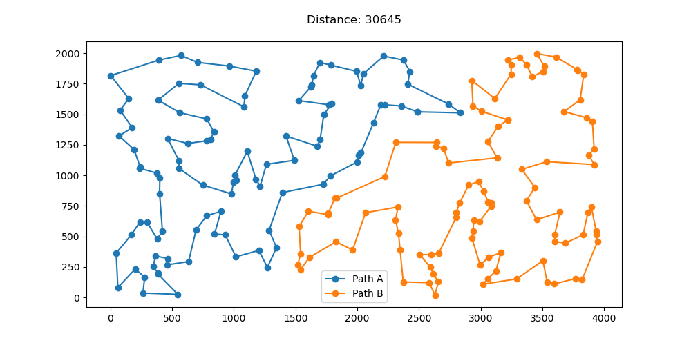

# Laboratorium 4 - Rozszerzenie algorytmów lokalnego przeszukiwania

## Autorzy: Michał Pawlicki, Mateusz Noworolnik

## Opis zadania

Celem zadania jest rozszerzenie algorytmów lokalnego przeszukiwania dla problemu komiwojażera. Zaimplementowano trzy wersje algorytmu: lokalne przeszukiwanie z róznymi miejscami startowymi, iteracyjne przeszukiwanie z niewielką perturbacją, przeszukiwanie z większą perturbacją typu Destroy-Repair. Dodatkowo ostatni algorytm został uruchomiony w wersji z wykonywaniem lokalnego przeszykiwania w każdej iteracji i bez. Algorytmy zostały uruchomione na instancjach problemu kroA200 i kroB200.

## Opis algorytmów i funkcji pomocniczych

### MSLS

```
Wczytaj zbiór danych
Powtarzaj 100 razy:
  Wylosuj rozwiązanie początkowe
  Wykonaj przeszukiwanie lokalne strategią stromą
  Jeśli znaleziono lepsze rozwiązanie:
    Zapisz je jako rozwiązanie najlepsze
Zwróć rozwiązanie najlepsze
```

### ILS - Mała perturbacja

```
Wczytaj zbiór danych
Wylosuj rozwiązanie początkowe
Powtarzaj do osiągnięcia warunku stopu:
  Wykonaj perturbację
  Wykonaj przeszukiwanie lokalne strategią stromą
  Jeśli znaleziono lepsze rozwiązanie:
    Zapisz je jako rozwiązanie najlepsze
Zwróć rozwiązanie najlepsze
```

### Wykonaj małą perturbację

```
Powtarzaj 20 razy:
  Wylosuj typ ruchu
  Jeśli typ ruchu to zamiana krawędzi:
    Wylosuj dwie krawędzie z jednego cyklu
    Zamień je miejscami
  W przeciwnym wypadku:
    Wylosuj dwa wierzchołki z różnych cykli
    Zamień je miejscami
Zwróć rozwiązanie z perturbacją
```

### ILS - Repair-Destroy

```
Wczytaj zbiór danych
Wylosuj rozwiązanie początkowe
Powtarzaj do osiągnięcia warunku stopu:
  Wykonaj operację Destroy
  Wykonaj operację Repair
  Jeśli flaga lokalnego przeszukiwania jest ustawiona:
    Wykonaj przeszukiwanie lokalne strategią stromą
  Jeśli znaleziono lepsze rozwiązanie:
    Zapisz je jako rozwiązanie najlepsze
Zwróć rozwiązanie najlepsze
```

### Wykonaj operację Destroy

```
Znajdź wartość k będącą 30% długości cyklu
k := k/2
Powtarzaj 2 razy:
  Wylosuj indeks z pierwszego cyklu
  Usuń k kolejnych wierzchołków z pierwszego cyklu zaczytając od wylosowanego indeksu
  Wylosuj indeks z drugiego cyklu
  Usuń k kolejnych wierzchołków z drugiego cyklu zaczytając od wylosowanego indeksu
Zwróć otrzymane cykle
```

### Wykonaj operację Repair

```
Uruchom heurystykę rozbudowy cyklu
```

## Wynik eksperymentów

### KroA

| Konfiguracja                                                               | Wartość funkcji celu    | Czas (ms)                  |
| -------------------------------------------------------------------------- | ----------------------- | -------------------------- |
| MSLS                                                                       | 38142.1 (37208 - 38848) | 1049876 (992299 - 1495519) |
| ILS - Mała perturbacja                                                     | 38362.4 (35666 - 41470) | ---                        |
| ILS - Repair-Destroy wersja bez lokalnego przeszykiwania w każdej iteracji | 31905.4 (30975 - 32592) | ---                        |
| ILS - Repair-Destroy wersja z lokalnym przeszykiwaniem w każdej iteracji   | 31101.2 (30660 - 31612) | ---                        |

### MSLS


### ILS - Mała perturbacja


### ILS - Repair-Destroy wersja bez lokalnego przeszykiwania w każdej iteracji


### ILS - Repair-Destroy wersja z lokalnym przeszykiwaniem w każdej iteracji


### KroB

| Konfiguracja                                                               | Wartość funkcji celu    | Czas (ms)                   |
| -------------------------------------------------------------------------- | ----------------------- | --------------------------- |
| MSLS                                                                       | 38611.7 (37989 - 39124) | 995968.8 (985277 - 1000642) |
| ILS - Mała perturbacja                                                     | 38053.7 (35657 - 41156) | ---                         |
| ILS - Repair-Destroy wersja bez lokalnego przeszykiwania w każdej iteracji | 31642.8 (30973 - 32789) | ---                         |
| ILS - Repair-Destroy wersja z lokalnym przeszykiwaniem w każdej iteracji   | 31166.2 (30645 - 31445) | ---                         |

### MSLS


### ILS - Mała perturbacja


### ILS - Repair-Destroy wersja bez lokalnego przeszykiwania w każdej iteracji


### ILS - Repair-Destroy wersja z lokalnym przeszykiwaniem w każdej iteracji



## Wnioski

Z przeprowadzonych eksperymentów wynika, że algorytm iteracyjengo przeszukiwania lokalnego z perturbacją typu Destroy-Repair daje najlepsze wyniki. Wersja z wykonywaniem lokalnego przeszukiwania w każdej iteracji daje lepsze wyniki niż wersja bez, jednak różnica nie jest duża. Algorytm MSLS daje podobne wyniki średnie do algorytmu ILS z małą perturbacją, jednak algorithm ILS daje lepsze wyniki minimalne.

## Kod programu

https://github.com/michal-pawlicki/inteligentne-metody-optymalizacji/tree/main/Lab4
