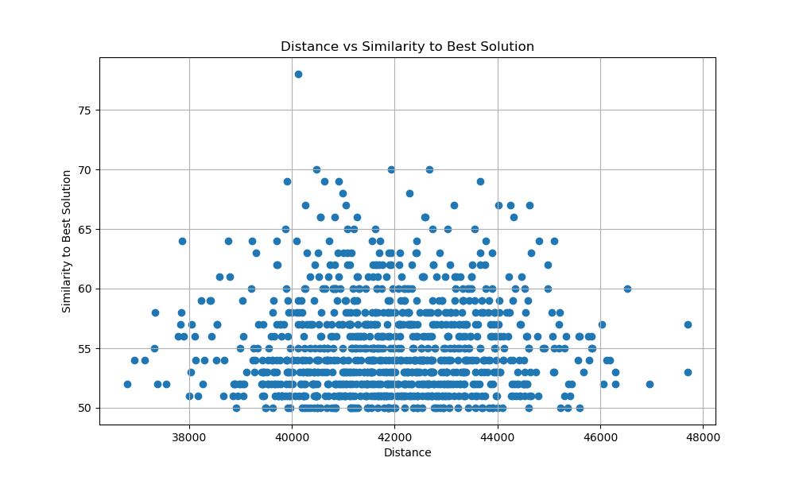
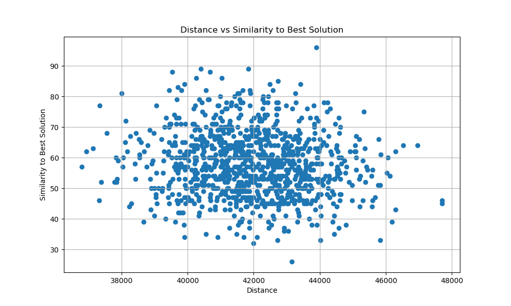
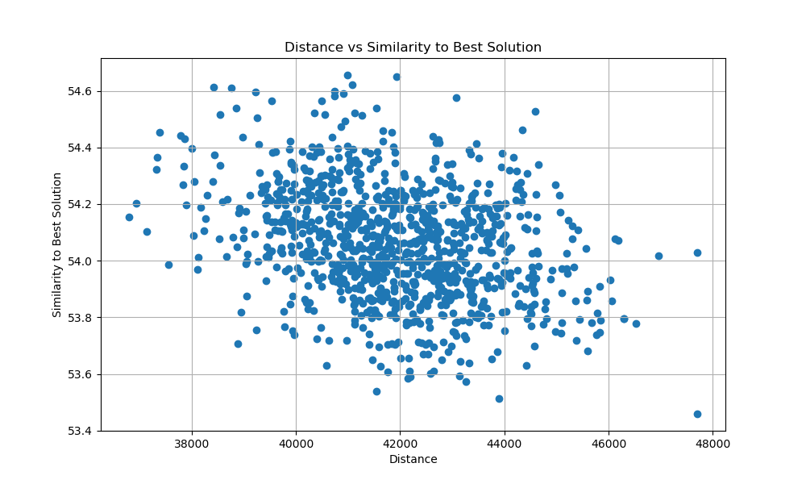
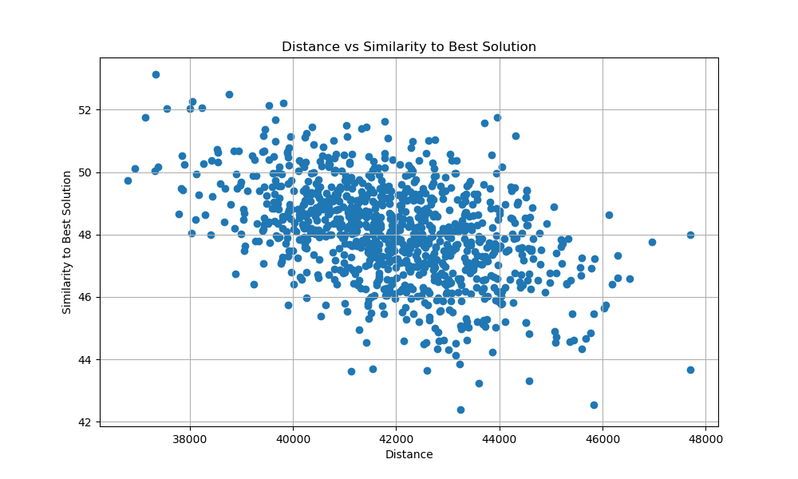

# Laboratorium 5 - Hybrydowe algorytmy ewolucyjne

## Autorzy: Michał Pawlicki, Mateusz Noworolnik

## Opis zadania

Celem zadania jest zaimplementowanie hybrydowych algorytmów ewolucyjnych dla problemu komiwojażera. Zaimplementowano dwie wersje algorytmu: z użyciem lokalnego przeszukiwania w każdej iteracji i bez. Algorytmy zostały uruchomione na instancjach problemu kroA200 i kroB200.

## Opis algorytmów i funkcji pomocniczych

### Hybrydowy algorytm ewolucyjny

```
Wczytaj zbiór danych
Wylosuj populację początkową o rozmiarze k poprzez uruchomienie algorytmu przeszukiwania lokalnego z losowym rozwiązaniem początkowym
Powtarzaj do osiągnięcia warunku stopu:
  Wylosuj parę rodziców
  Stwórz potomka przez zastosowanie operatora krzyżowania
  Jeśli flaga lokalnego przeszukiwania jest ustawiona:
    Wykonaj przeszukiwanie lokalne strategią stromą
  Jeśli funkcja celu potomka jest rózna od funkcji celu wszystkich osobników w populacji:
    Dodaj potomka do populacji
  Usuń z populacji osobnika o najgorszej funkcji celu
Zwróć najlepsze rozwiązanie z populacji
```

### Operator krzyżowania

```
Skopiuj rozwiązanie rodzica 1 do potomka
Dla każdego wierzchołka w potomku:
  Jeśli krawędź stworzona przez wierzchołek i jego następnika lub poprzednika nie istnieje w rozwiązaniu rodzica 2:
    Usuń ten wierzchołek z potomka
Stwórz rozwiązanie poprzez uruchomienie algorytmyrozbudowy cyklu na pozoostałych wierzchołkach
```

## Wyniki eksperymentów

### KroA

| Konfiguracja                                                               | Wartość funkcji celu     | Czas (ms)                  | Liczba iteracji            |
| -------------------------------------------------------------------------- | ------------------------ | -------------------------- | -------------------------- |
| MSLS                                                                       | 38142.1 (37208 - 38848)  | 1049876 (992299 - 1495519) | 1000                       |
| ILS - Mała perturbacja                                                     | 38362.4 (35666 - 41470)  | ---                        | 11426.3 (11393 - 11456)    |
| ILS - Repair-Destroy wersja bez lokalnego przeszykiwania w każdej iteracji | 31905.4 (30975 - 32592)  | ---                        | 2650.9 (2640 - 2656)       |
| ILS - Repair-Destroy wersja z lokalnym przeszukiwaniem w każdej iteracji   | 31101.2 (30660 - 31612)  | ---                        | 1254.3 (1210 - 1313)       |
| Hybrydowy algorytm ewolucyjny bez lokalnego przeszukiwania                 | 34263.75 (32887 - 35723) | ---                        | 590004.8 (389611 - 703333) |
| Hybrydowy algorytm ewolucyjny z lokalnym przesukiwaniem                    | 34114 (33158 - 35489)    | ---                        | 17571.25 (14033 - 20057)   |

### KroB

| Konfiguracja                                                               | Wartość funkcji celu    | Czas (ms)                   | Liczba iteracji            |
| -------------------------------------------------------------------------- | ----------------------- | --------------------------- | -------------------------- |
| MSLS                                                                       | 38611.7 (37989 - 39124) | 995968.8 (985277 - 1000642) | 1000                       |
| ILS - Mała perturbacja                                                     | 38053.7 (35657 - 41156) | ---                         | 11435.2 (11363 - 11473)    |
| ILS - Repair-Destroy wersja bez lokalnego przeszykiwania w każdej iteracji | 31642.8 (30973 - 32789) | ---                         | 2650.8 (2641 - 2658)       |
| ILS - Repair-Destroy wersja z lokalnym przeszykiwaniem w każdej iteracji   | 31166.2 (30645 - 31445) | ---                         | 1344.8 (1287 - 1412)       |
| Hybrydowy algorytm ewolucyjny bez lokalnego przeszukiwania                 | 35546.5 (33534 - 36546) | ---                         | 314795.5 (165666 - 462877) |
| Hybrydowy algorytm ewolucyjny z lokalnym przesukiwaniem                    | 34215 (33258 - 34978)   | ---                         | 18449 (16613 - 19294)      |

# Laboratorium 6 - Testy globelnej wypukłości

## Podobieństwo do najlepszego rozwiązania (ILS - Repair-Destroy wersja z lokalnym przeszukiwaniem w każdej iteracji)

### Miara podobieństwa: liczba wspólnych wierzchołków

Współczynnik korelacji: 0.016



### Miara podobieństwa: liczba wspólnych krawędzi

Współczynnik korelacji: -0.11



## Średnie podobieństwo do wszystkich rozwiązań

### Miara podobieństwa: liczba wspólnych wierzchołków

Współczynnik korelacji: -0.32



### Miara podobieństwa: liczba wspólnych krawędzi

Współczynnik korelacji: -0.45



## Kod programu

https://github.com/michal-pawlicki/inteligentne-metody-optymalizacji/tree/main/Lab5
